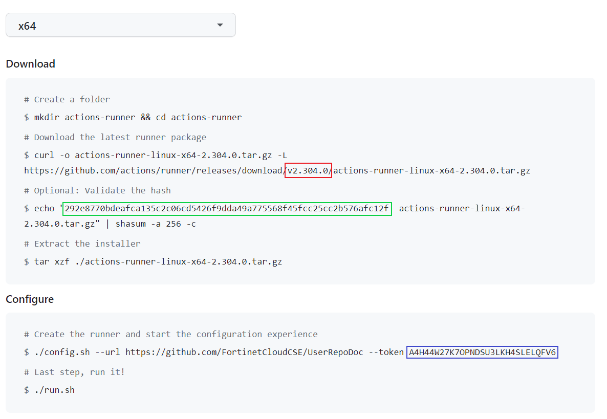
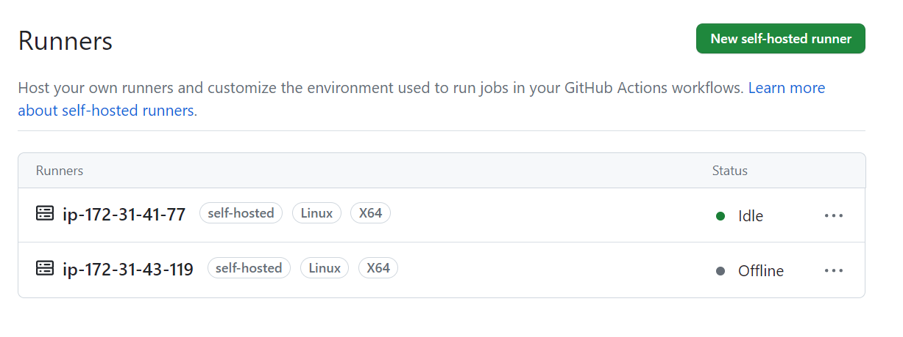

# Creating a New GitHub Actions Runner

This CloudFormation Template can be used to quickly spin up a GitHub Actions Runner on an EC2 instance. 

## Prereqs

- Pre-existing VPC.

- GitHub repo already setup and ready to integrate with GitHub Actions.


## Launch using the AWS CLI

- Set the user profile and region environment variables.

```
export AWS_DEFAULT_REGION=us-east-1 && export AWS_PROFILE=user-admin
```

### Parameters

- In GitHub, click 'Settings'.

- Click 'Actions' on the left sidebar. On the dropdown, click 'Runners'.

- At the top right of the page, click 'New Self-hosted Runner.'

- Under 'Runner Image', Select 'Linux'.

- There are several pieces of information on this page that you'll need to paste into the launch-runner-params.yaml file.

  * VPCtoUse: Any pre-existing VPC in your AWS account. 
  * KeyPair: The name of a key pair in your AWS account.
  * For OrgName and RepoName, these can be found in the URL of your GitHub Repo. i.e. https://github.com/OrgName/RepoName
  * RunnerVersion, GHAToken, and HashCheck can be found in the Download and Configure Sections of the Create Runner page, as shown below (red, blue, and green boxes, respectively).

  

  * When finished, your launch-runner-params.yaml file should look like this example:

```
[
    {        
         "ParameterKey": "VPCtoUse",
         "ParameterValue": "vpc-abcd1234"
    },
    {
         "ParameterKey": "GHAToken",
         "ParameterValue": "A4H44WZT5RK4EOBUG5FZV2TEKKN4W"
    },
    {
         "ParameterKey": "KeyPair",
         "ParameterValue": "MyKeyPair"
    },
    {
         "ParameterKey": "HashCheck",
         "ParameterValue": "292e8770bdeafca135c2c06cd5426f9dda49a775568f45fcc25cc2b576afc12f"
    },
    {
         "ParameterKey": "OrgName",
         "ParameterValue": "MyOrg"
    },
    {
         "ParameterKey": "RepoName",
         "ParameterValue": "MyRepo"
    },
    {
         "ParameterKey": "RunnerVersion",
         "ParameterValue": "2.304.0"
    }
]
```
- Now, issue the following command to launch the CloudFormation Stack:

```
aws cloudformation create-stack --stack-name <enter a name for your stack here> \
   --template-body file://./launch-runner-ec2.yml --parameters file://./launch-runner-params.json \ 
   --capabilities CAPABILITY_NAMED_IAM
```
- You will see a generated stack ID if the command was executed successfully. You can monitor the status of the stack as it's being built in the CloudFormation console. Once complete, you will see the runner listed on the 'Runners' page as below. 

  

- Also note that the EC2 instance is launched with permissions enabling connection via Session Manager for any required troubleshooting or modifications.

* To enable the runner to perform operations on a Kubernetes cluster, identify the ARN of the role attached to the EC2 instance hosting the runner and issue
the following command:

```
eksctl create iamidentitymapping --cluster <Cluster Name> --region $AWS_DEFAULT_REGION --arn <Runner IAM Role ARN> --group system:masters --username admin
``` 
