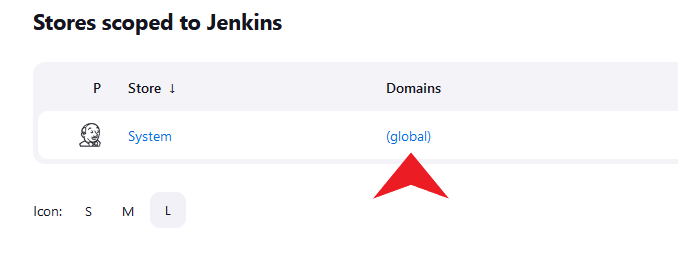
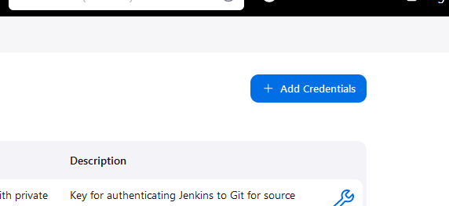
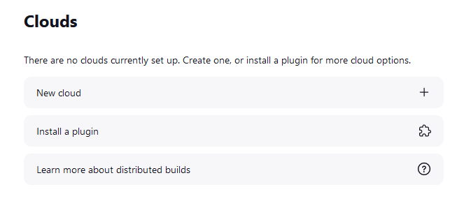
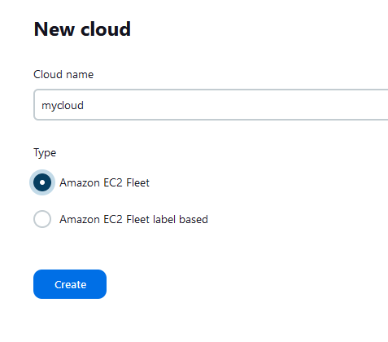
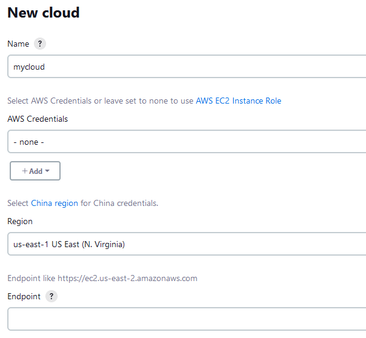
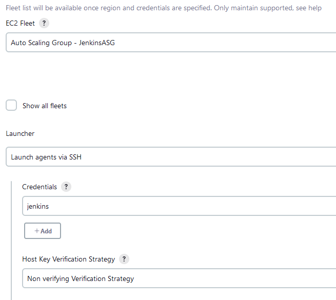
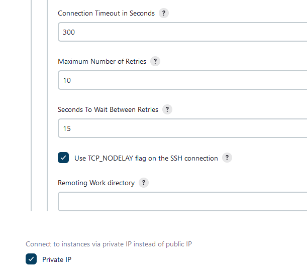

## Getting Started

These AWS launch templates can help you get started setting up a basic Jenkins cluster on a set of EC2 instances.

The first set of steps are for creating a new cluster from scratch, and the second are for the scenario where you've uploaded the JENKINS_HOME
directory and keystore of an existing Jenkins installation to an S3 location and want to migrate to a new cluster.  

### Starting from Scratch

First, you'll need to populate the parameters file with references to your existing AWS resources. Then you can go ahead and deploy the launch template. For this scenario where we're creating a new cluster from scratch, leave the three Jenkins parameter values blank ("").

| Parameter                | Description                                                                              |
| ------------------------ | ---------------------------------------------------------------------------------------- |               
| MNKeyPair                | Main node key pair.                                                                      |
| WNKeyPair                | Worker node key pair.                                                                    |
| VPCId                    | ID of VPC where cluster will be deployed.                                                |
| MySubnet                 | ID of subnet where cluster will be deployed.                                             | 
| JenkinsBucket            | ARN of S3 bucket containing existing JENKINS_HOME directory and keystore. (if migrating) | 
| JenkinsHomeS3Location    | S3 URI of JENKINS_HOME                                                                   |
| JenkinsKeyStoreLocation  | S3 URI of location of Jenkins keystore                                                   |


```
cp jenkins-params-template.json jenkins-params.json 

# Paste in parameter values to jenkins-params.json 

aws cloudformation create-stack --stack-name jenkins-cluster \
  --template-body file://./jenkins-cluster.yaml \
  --parameters file://./jenkins-params.json --capabilities CAPABILITY_NAMED_IAM
```
After successful launch of the CloudFormation stack, launch an EC2 instance from the created launch template with the name that starts with "JenkinsMainLaunchTemplate..."

Access the instance via session manager and retrieve the initial Jenkins password:

```
> sudo cat /var/lib/jenkins/secrets/initialAdminPassword
abcd1234efghijkl09876plmokn654322
```
Then, retrieve the EC2 instance public IP, open up a browser, and navigate to http://<public IP>:8080.

The Jenkins console will open and will ask you for the password. Paste it into the text box. Then, choose to either install a specific set of plugins or accept the default installation. Once plugin installation is finished, you may create a default user with which to access the console or skip for now. If you skip, you'll need to keep the initial password handy and use that to access the console.

The main node of your cluster is now ready to be configured.

### HTTPS Setup

To enforce Jenkins console access via HTTPS, there are a few additional steps you'll need to take. One of the more simple means of doing this involves [Let's Encrypt](https://letsencrypt.org/), a free and open CA. 

First, access the main node EC2 instance once again via session manager, and at the ssm-user command line, install [certbot](https://certbot.eff.org/), a popular *Let's Encrypt* client, and create the certificates.

```
sudo yum install -y certbot
sudo certbot certonly --standalone
```

You'll be prompted to enter your email address, accept the Let's Encrypt Terms of Service, and opt in or out of receiving emails from EFF. You'll also need to paste in the domain name at which your Jenkins node sits. Enter the complete domain name, including subdomains (i.e. jenkins.fortinetcloudcse.com).

Once the certs are created, they'll be accessible at /etc/letsencrypt/live/\<the Jenkins domain name you configured\>/.

We're going to copy everything over to a convenient location, but feel free to work in an alternate directory if you'd like.

At this point, you'll need to create a passphrase for the eventual Jenkins keystore we'll be creating and store it in a file. We'll use it in steps leading up to the keystore creation.

```
sudo mkdir -p /var/lib/jenkins/.ssl
sudo chown jenkins:jenkins /var/lib/jenkins/.ssl
sudo cp /etc/letsencrypt/live/<Jenkins domain name>/* /var/lib/jenkins/.ssl  
sudo su jenkins -s /bin/bash
echo my-P@ssw0rd > /var/lib/jenkins/.ssl/passphrase.txt
```

Create the PKCS archive.

```
cd /var/lib/jenkins/.ssl
openssl pkcs12 -export -out jenkins.p12 -passout 'file:passphrase.txt' -inkey privkey.pem -in fullchain.pem
```

Create the Jenkins keystore from the PKCS archive.

```
keytool -importkeystore -srckeystore jenkins.p12 \
  -srcstorepass:file passphrase.txt -srcstoretype PKCS12 \
  -destkeystore jenkins.jks -deststorepass:file passphrase.txt 
```

Copy the keystore to a location we'll be configuring (in systemd a few steps down) and adjust permissions. (To run these commands, you can exit the Jenkins user shell and run them as ssm-user without needing to set up a sudo password).

```
sudo mkdir -p /etc/jenkins
sudo cp jenkins.jks /etc/jenkins
sudo chown -R jenkins:jenkins /etc/jenkins
sudo chmod 700 /etc/jenkins
sudo chmod 600 /etc/jenkins/jenkins.jks
```

Create a Jenkins Systemd service override directory and file.

```
sudo mkdir -p /etc/systemd/system/jenkins.service.d
sudo touch /etc/systemd/system/jenkins.service.d/override.conf
sudo cat << EOF > /etc/systemd/system/jenkins.service.d/override.conf
[Service]
Environment="JENKINS_PORT=-1"
Environment="JENKINS_HTTPS_PORT=8443"
Environment="JENKINS_HTTPS_KEYSTORE=/etc/jenkins/jenkins.jks"
Environment="JENKINS_HTTPS_KEYSTORE_PASSWORD=my-P@ssw0rd"
Environment="JENKINS_HTTPS_LISTEN_ADDRESS=0.0.0.0"
EOF
```
Finally, reload the Systemd manager configuration and restart the Jenkins service.

```
sudo systemctl daemon-reload
sudo systemctl restart jenkins
```

You should now be able to open up a web browser and navigate to https://\<jenkins domain name\>:8443

### Migrating to a new Jenkins Installation

To utilize these templates to migrate an existing Jenkins installation to a new server, copy objects within the existing JENKINS_HOME and JENKINS_HTTPS_KEYSTORE locations to an S3 location and specify the S3 URI of each in the CloudFormation parameter template file as values for the JenkinsHomeS3Location and JenkinsKeyStoreLocation parameters, respectively. In order for the EC2 instance where your Jenkins Main node will be deployed to have permissions to download those objects from S3, ensure you also paste in the ARN of the bucket where these objects are located as a value for the JenkinsBucket parameter as well.

Once you do launch the "JenkinsMainLaunchTemplate..." and it deploys successfully, your new Jenkins install will be ready to go and you can navigate to the public IP of the EC2 instance on port 8080 to access Jenkins. 

If you'd like to enable https for the server, you'll need to access the ssm-user command line of the EC2 instance via session manager and update the Jenkins systemd service settings. The launch template user data is configured to copy the JENKINS_HTTPS_KEYSTORE from S3 to /etc/jenkins, so we're specifying that as the new keystore location here in this example as well. This method also assumes your new domain name matches the old one which the keystore is configured for.

```
sudo mkdir -p /etc/systemd/system/jenkins.service.d
sudo touch /etc/systemd/system/jenkins.service.d/override.conf
sudo cat << EOF > /etc/systemd/system/jenkins.service.d/override.conf
[Service]
Environment="JENKINS_PORT=-1"
Environment="JENKINS_HTTPS_PORT=8443"
Environment="JENKINS_HTTPS_KEYSTORE=/etc/jenkins/jenkins.jks"
Environment="JENKINS_HTTPS_KEYSTORE_PASSWORD=<Jenkins keystore password>"
Environment="JENKINS_HTTPS_LISTEN_ADDRESS=0.0.0.0"
EOF
sudo systemctl daemon-reload
sudo systemctl restart jenkins
```

### Configuring EC2 Fleet Plugin

The Jenkins [EC2 Fleet plugin](https://plugins.jenkins.io/ec2-fleet/) enables integration with an Auto Scaling group in AWS for the cases when worker node scaling is needed and/or a node is having issues and needs to be shut down and replaced. 

To configure the plugin, you'll first need to add the private key of your worker node AWS key pair to the Jenkins console. 

In Jenkins, navigate to Dashboard > Manage Jenkins > Credentials. Under **Stores scoped to Jenkins**, under the **Domains** heading, click **(global)**.



Click **Add Credentials**



Select **SSH Username with private key** in the **Kind** dropdown. Leave **Scope** set to Global, and choose an ID for the credential. Optionally enter a description. For **Username**, paste in the name of the key pair you specified for the worker node launch template during setup.

Under **Private Key**, click **Enter Directly**, and then click **Add**. Paste in the key, and click **Create**.


Now, in Jenkins, navigate to Dashboard > Manage Jenkins > Clouds, and select **New Cloud**.



Give the cloud a name, select type **Amazon EC2 Fleet**, and click **Create**.



On the following screen, select the region where your Auto Scaling group exists, leave **AWS Credentials** set to none, and leave **Endpoint** blank.



Under **EC2 Fleet**, select the Auto Scaling group created at setup ("JenkinsASG" if you haven't altered the CloudFormation template). Under **Launcher**, select **Launch agents via SSH**. Under credentials, select the credential created above. Select **Non verifying Verification Strategy** for **Host Key Verification Strategy**. 



Under **Advanced**, ensure Port is set to **22**, and leave all other settings as is, except for the following:

|                                  |     |
| -------------------------------- | --- |
| Connection Timeout in Seconds:   | 300 |
| Maximum Number of Retries:       | 10  |
| Seconds to Wait Between Retries: | 15  |

Ensure the **Use TCP_NODELAY flag on the SSH connection** and **Private IP** boxes are checked. Click **Save**.



You should now see a new instance creating in the AWS EC2 console. 

In Jenkins, you can also navigate to Dashboard > Manage Jenkins > Nodes, and you'll see the new node there with a name in the form of '\<cloud\> \<EC2 instance id\>'. It may take a few moments to become available.

### Integrating GitHub

